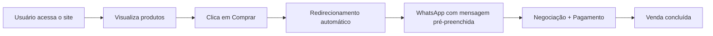

# 🚀 UGO Celulares  
### E-commerce Inteligente com Fechamento via WhatsApp

  
  
  
  

  💬 Venda direta • 📱 Atendimento humanizado • ⚡ Checkout simplificado

---

## 🌐 Demonstração

🔗 **Acesse o projeto online:**  
👉 https://ugocelulares.comm.seg.br/

---

# 🧠 Conceito

O **UGO Celulares** é um modelo de **WhatsApp Commerce**, onde o site atua como vitrine digital e o fechamento da venda acontece diretamente via WhatsApp.

Esse formato elimina:

- ❌ Checkout complexo  
- ❌ Gateway de pagamento obrigatório  
- ❌ Sistemas pesados  

E prioriza:

- ✅ Conversão rápida  
- ✅ Atendimento personalizado  
- ✅ Negociação direta  
- ✅ Simplicidade operacional  

---

# ⚙️ Fluxo da Aplicação

ESTRUTURA

📦 ugocelulares
 ┣ 📜 index.html
 ┣ 📂 css
 ┃ ┗ 📜 styles.css
 ┣ 📂 js
 ┃ ┗ 📜 main.js
 ┣ 📂 assets
 ┃ ┣ 📂 images
 ┃ ┗ 📂 icons
 ┗ 📜 README.md

 TEST VOCÊ MESMO

 # Clone o repositório
git clone https://github.com/seuusuario/ugocelulares.git

# Acesse a pasta
cd ugocelulares

# Abra o index.html no navegador
